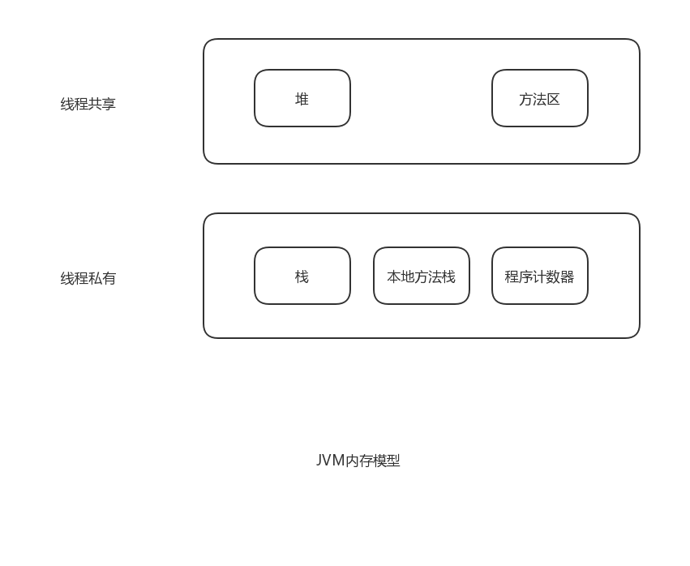
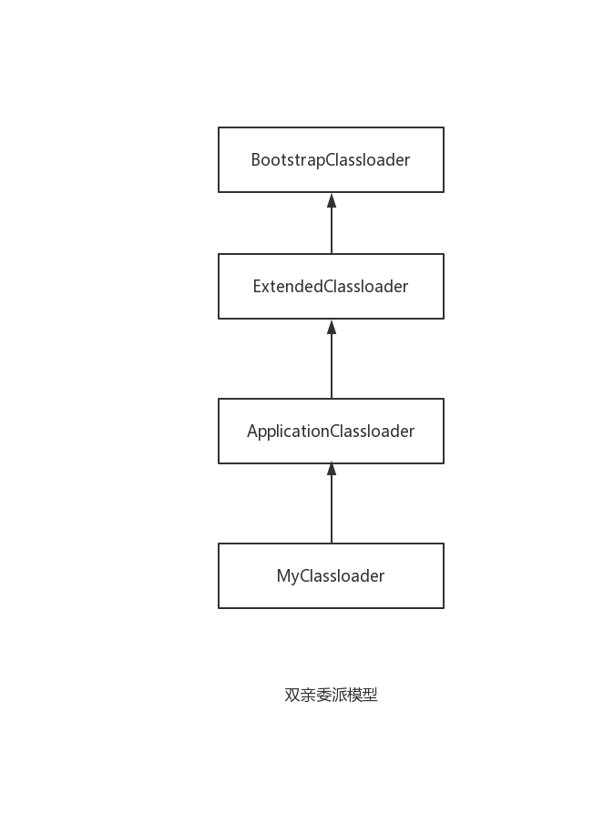

<!-- GFM-TOC -->
* [一、JVM内存模型](##JVM内存模型)
* [二、JMM](##JMM)
* [三、双亲委派](##双亲委派)
* [四、类加载](##类加载)
* [五、gc](##gc)
* [六、锁](##锁)
<!-- GFM-TOC -->
## JVM内存模型


## JMM
- 什么是 JMM , JMM 全称JavaMemoryModel。是Java的内存模型。区别与JVM的内存模型。该内存模型是说线程的工作内存和主内存（主要是堆内存）的关系。


## 双亲委派
- 什么是双亲委派？
Java类加载是基于双亲委派机制，Java类加载器有三大顶级基类

```
双亲委派模型下一个类加载如果有基类加载器则交由父类加载。
直至最顶层加载器，如果父类无法完成加载才由自己加载。
双亲委派模式保证了jdk的安全性。系统类全限名类统一交由顶层classLoader
其他人无法破坏系统方法，保证了系统方法的安全。

是否有办法破坏双亲委派模型。答案是有；
classLoader类有两个方法。
findClass 返回Class类型用于重写自己的classLoader
loaderClass 返回Class类型，定义了双亲委派规则。该方法可用以破坏双亲委派。
```

## 类加载
类使用过程分为以下步骤
- 加载（把二进制文件加载到内存当中）
- 连接
  - 验证
    - 确保class文件中字节流包含的信息符合当前虚拟机的要求
    - 文件格式的验证：验证是否符合Class文件格式的规范
    - 元数据的验证：对字节码描述的信息进行语法校验
    - 字节码验证：验证程序的控制流程
    - 符号引用验证：发生在虚拟机将二进制符号转换为直接引用的时候 
  - 准备
  - 引用
    - 将二进制符号的引用替换为直接引用
- 初始化
- 使用
- 卸载（gc）